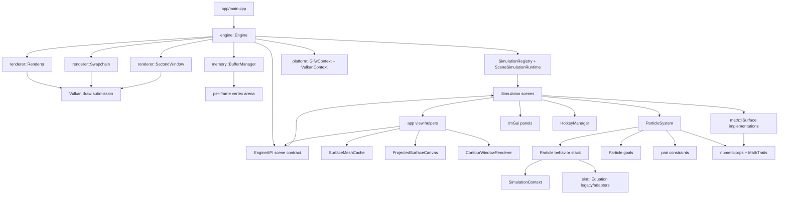
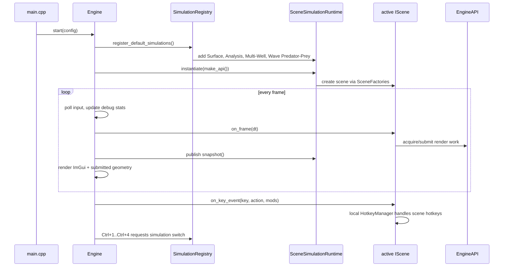
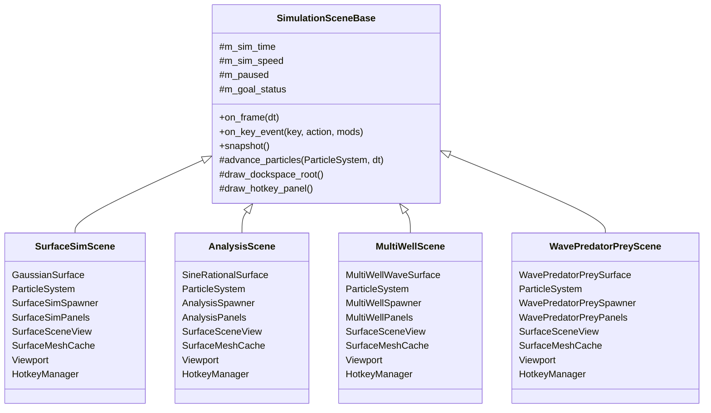
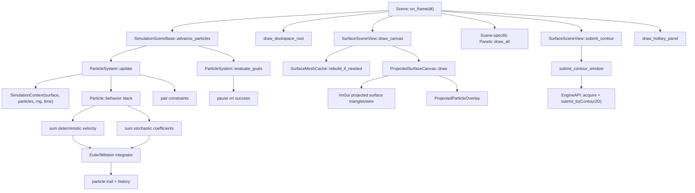
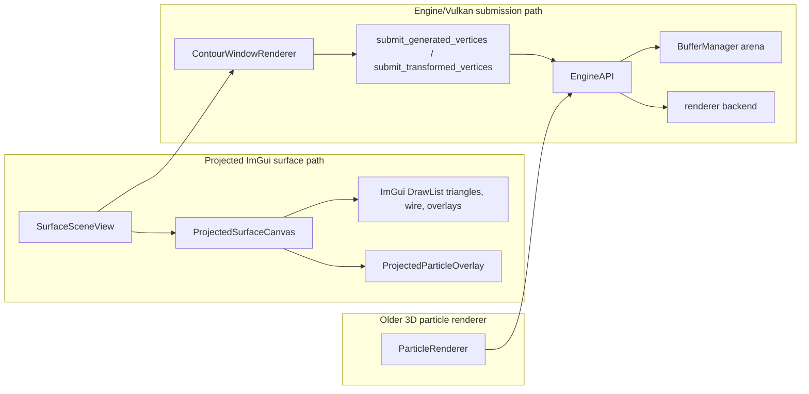
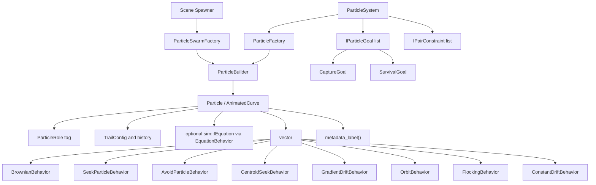
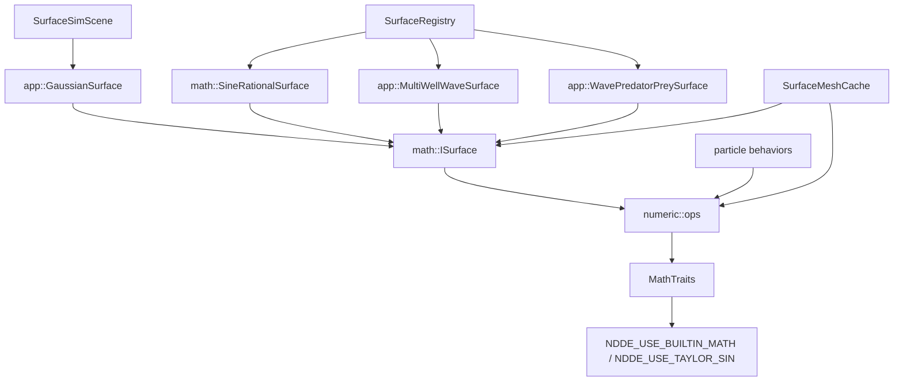

# Current Architecture Diagram

Generated from the live `src` tree. This document is meant to be a refactor guide, so it shows both the current component boundaries and the places where responsibilities still overlap.

## System Layers

## Runtime And Scene Switching

## Scene Component Pattern

The four current simulations now mostly follow the same shape.

## Per-Frame Scene Flow

## Rendering Paths

There are currently two rendering styles in the app layer.

Current note: the main 3D surface views are projected through ImGui draw lists, while the second contour window uses `EngineAPI` and the Vulkan renderer path. `PrimitiveRenderer` exists as a domain-neutral engine helper over `EngineAPI`, but the app still has direct submission helpers and an older `ParticleRenderer`.

## Particle Model

## Surface And Math Routing

Math intent: app, sim, and math code should route through `numeric::ops` / `MathTraits` for trigonometry and scalar operations. The Taylor sine approximation is selectable through the CMake compile definition `NDDE_USE_TAYLOR_SIN`.

## Current Simulations

| Hotkey | Runtime name | Scene class | Surface | Particle setup |
| --- | --- | --- | --- | --- |
| `Ctrl+1` | Surface Simulation | `SurfaceSimScene` | `GaussianSurface` | `SurfaceSimSpawner`, leader pursuit, Brownian cloud, contour band |
| `Ctrl+2` | Sine-Rational Analysis | `AnalysisScene` | `SineRationalSurface` | level walkers and analysis overlays |
| `Ctrl+3` | Multi-Well Centroid | `MultiWellScene` | `MultiWellWaveSurface` | centroid/avoider showcase |
| `Ctrl+4` | Wave Predator-Prey | `WavePredatorPreyScene` | `WavePredatorPreySurface` | predator/prey and swarm recipes |

## Clean Boundaries

These boundaries are now relatively healthy:

- `EngineAPI` is the narrow scene-to-engine contract. Scenes do not need raw Vulkan access.
- `SimulationSceneBase` owns shared pause/time/snapshot/goal lifecycle.
- Each scene owns its local surface, particles, spawner, panels, viewport, hotkeys, and mesh cache.
- `SurfaceSceneView` is the shared app-level view for surface scenes.
- `ParticleSystem` owns particles, goals, pair constraints, RNG, and per-frame `SimulationContext`.
- `ParticleSwarmFactory` owns reusable swarm recipes and recipe metadata.
- `SurfaceRegistry` owns named reusable surface definitions, except Sim 1's `GaussianSurface`.

## Refactor Pressure Points

These are the main places to guide the next cleanup.

### 1. Rendering Still Has Split Personalities

`ProjectedSurfaceCanvas` renders the primary 3D surface through ImGui draw lists. `ContourWindowRenderer` submits to the engine/Vulkan path. `ParticleRenderer` and `PrimitiveRenderer` are both present, but not the single obvious path for all primitives.

Recommended direction:

- Keep `PrimitiveRenderer` in `engine` as the domain-neutral draw helper.
- Keep `SurfaceSceneView` in `app` as the surface-domain helper.
- Decide whether the primary 3D surface should remain an ImGui-projected preview or migrate to the engine submission path.
- If it remains projected, rename it explicitly as a projected/preview path so expectations are clear.

### 2. `AnimatedCurve` Is Still The Concrete Particle Type

The architecture now treats it as `Particle`, but the type name remains `AnimatedCurve`. That leaks old vocabulary into `ParticleSystem`, `SimulationContext`, renderers, and tests.

Recommended direction:

- Rename `AnimatedCurve` to `Particle` when the codebase is otherwise calm.
- Keep `using AnimatedCurve = Particle` temporarily if needed for staged migration.
- Move Frenet/history/trail concerns into particle-oriented file names.

### 3. Scene Classes Still Wire Similar Objects By Hand

The scenes are much closer now, but constructors and `on_frame` still repeat the same pattern.

Recommended direction:

- Introduce a `SurfaceSceneShell` or `SurfaceSimulationHost` only if duplication starts blocking work.
- Keep scene-specific panels/spawners separate for now. They are good domain boundaries.
- Extract common `SurfaceSceneViewOptions` construction only after the visual options stabilize.

### 4. Surface Registry Is Partial

`SineRationalSurface`, `MultiWellWaveSurface`, and `WavePredatorPreySurface` are registry-backed. `GaussianSurface` is still separate.

Recommended direction:

- Add Gaussian to `SurfaceRegistry`.
- Consider returning `std::unique_ptr<math::ISurface>` from the registry when scenes do not need the concrete type.
- Keep concrete return types where panels genuinely need concrete surface APIs.

### 5. Panels Are Better But Still Scene-Specific

Each scene has its own panel component. Shared panels exist (`ParticleInspectorPanel`, `SwarmRecipePanel`, `PerformancePanel`, `PanelHost`), but not all panel behavior is generic yet.

Recommended direction:

- Continue extracting reusable panel sections only when at least two scenes need the same controls.
- Avoid pushing scene-specific swarm choices into a global panel too early.

### 6. Simulation Context Is Read-Oriented

`SimulationContext` gives behaviors surface, time, RNG, and particle lookup. It is lightweight and good, but not yet a full thread-safe shared state/history object.

Recommended direction:

- Keep it per-update and stack-local for behavior evaluation.
- Add explicit snapshot/history services before making it globally shared.
- If background simulation threads return, make `ParticleSystem` publish immutable snapshots rather than exposing mutable particle vectors.

## Suggested Next Refactor Sequence

1. Add `GaussianSurface` to `SurfaceRegistry` so all four sims source surfaces consistently.
2. Decide the rendering direction for the primary 3D surface: projected ImGui preview versus engine/Vulkan primitive path.
3. Rename `AnimatedCurve` to `Particle` in a focused mechanical pass.
4. Replace older `ParticleRenderer` use or remove it if fully superseded by projected overlays and `PrimitiveRenderer`.
5. Introduce a small shared `SurfaceSceneFrame` helper only if the four `on_frame` methods keep converging.
