# Proposed Architecture Diagram

This is the proposed target architecture for the next major refactor. It is intentionally not thread-oriented yet; threading should be a later refactor once the simulation/service/render boundaries are clean.

## Core Principle

```text
Engine owns lifecycle and services.
Simulation owns math state and recalculation.
RenderService owns renderer-neutral view submission.
Renderer owns Vulkan.
Panels and hotkeys are registered capabilities, not scene-owned side effects.
```

## Target System Layers

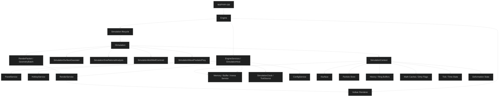

## Engine Services

The engine is the composition root. Simulations should not depend on concrete `Engine`; they receive a narrowed host/services interface.

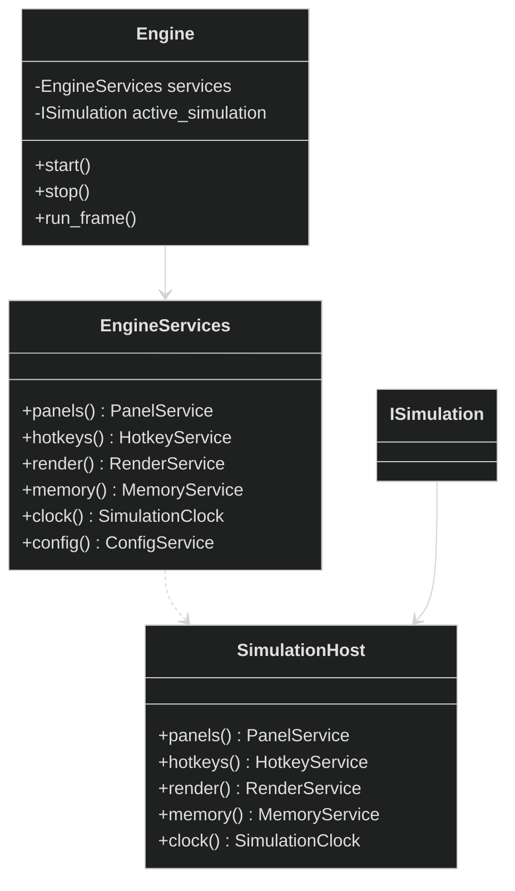

## Simulation Lifecycle

Registration uses RAII handles so panels, hotkeys, render views, and commands roll back automatically when a simulation stops or is destroyed.

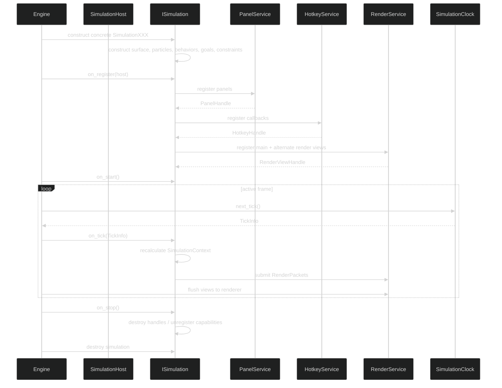

## ISimulation Contract

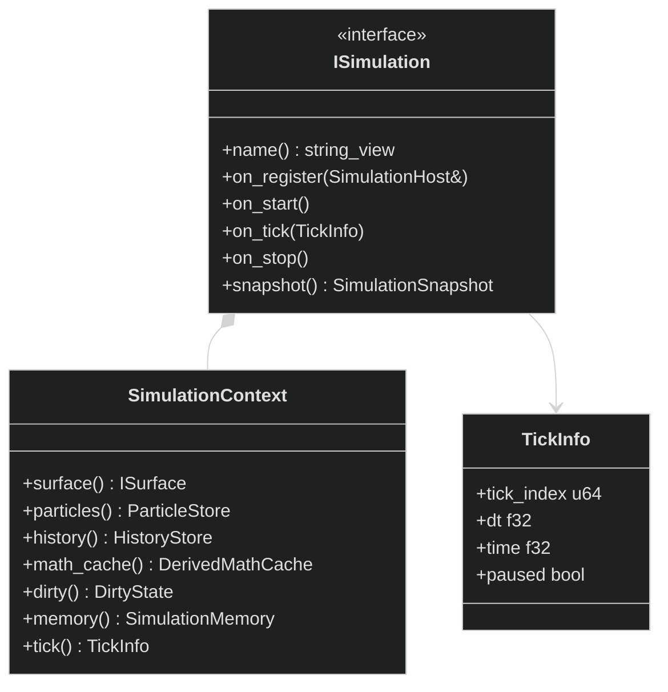

## SimulationContext As State

`SimulationContext` is the authoritative simulation state, not just a temporary accessor.

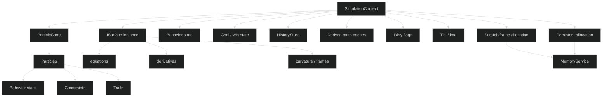

## Surfaces And Math

All domain structures should use NDDE-owned types and math wrappers. Backend/GPU types stay behind aliases or conversion boundaries.

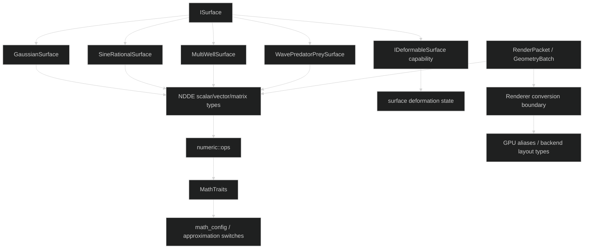

Rules:

- Domain, simulation, surface, particle, panel, and renderer-neutral structures use NDDE types.
- Math routes through `numeric::ops` / `MathTraits` or approved NDDE wrappers.
- Raw backend types do not leak into simulation APIs.
- GPU layout types live at renderer conversion boundaries.
- Surfaces may be static or dynamic/deformable.
- Time-varying surfaces evaluate against tick/time and deformation state.
- Deformation propagation is simulation math, not renderer logic.

## Deformable Surface Interaction

Deformable surfaces are simulation state. A user action, such as double-clicking a spot on the surface, becomes a simulation command that perturbs the surface and marks dependent caches/views dirty.

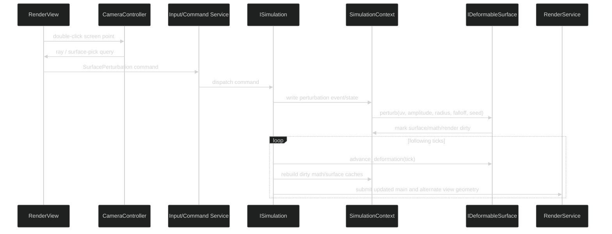

Suggested POD command:

```cpp
struct SurfacePerturbation {
    Vec2 uv;
    f32 amplitude;
    f32 radius;
    f32 falloff;
    u32 seed;
};
```

Architectural rules:

- Deformable surface state lives in `SimulationContext`.
- Input services produce POD commands; they do not mutate the surface directly.
- Simulations decide how perturbations evolve over time.
- Surface deformation marks main render views and alternate views dirty.
- Dynamic surface caches must rebuild as needed for surface mesh, contour/isocline/vector-field views, particles, and hover math.

## Render Views

Replace hard-coded `Contour2D` with registered render views. A render view might be shown as a second OS window today, a docked panel tomorrow, or a capture target later.

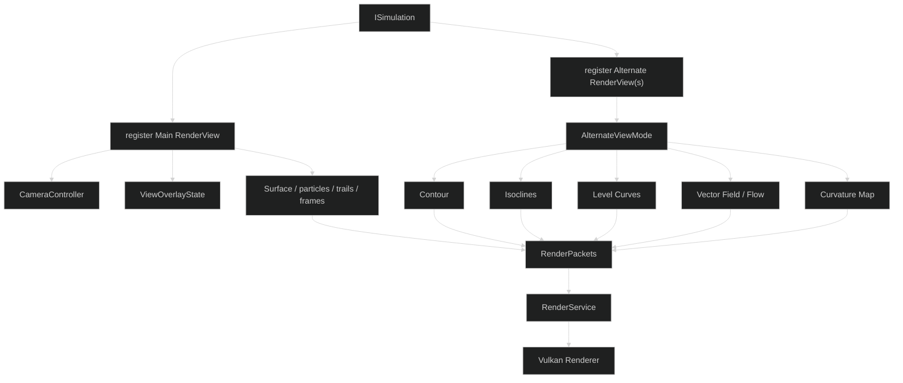

## Camera And View Overlays

Camera and axes belong to render views, not individual simulations.

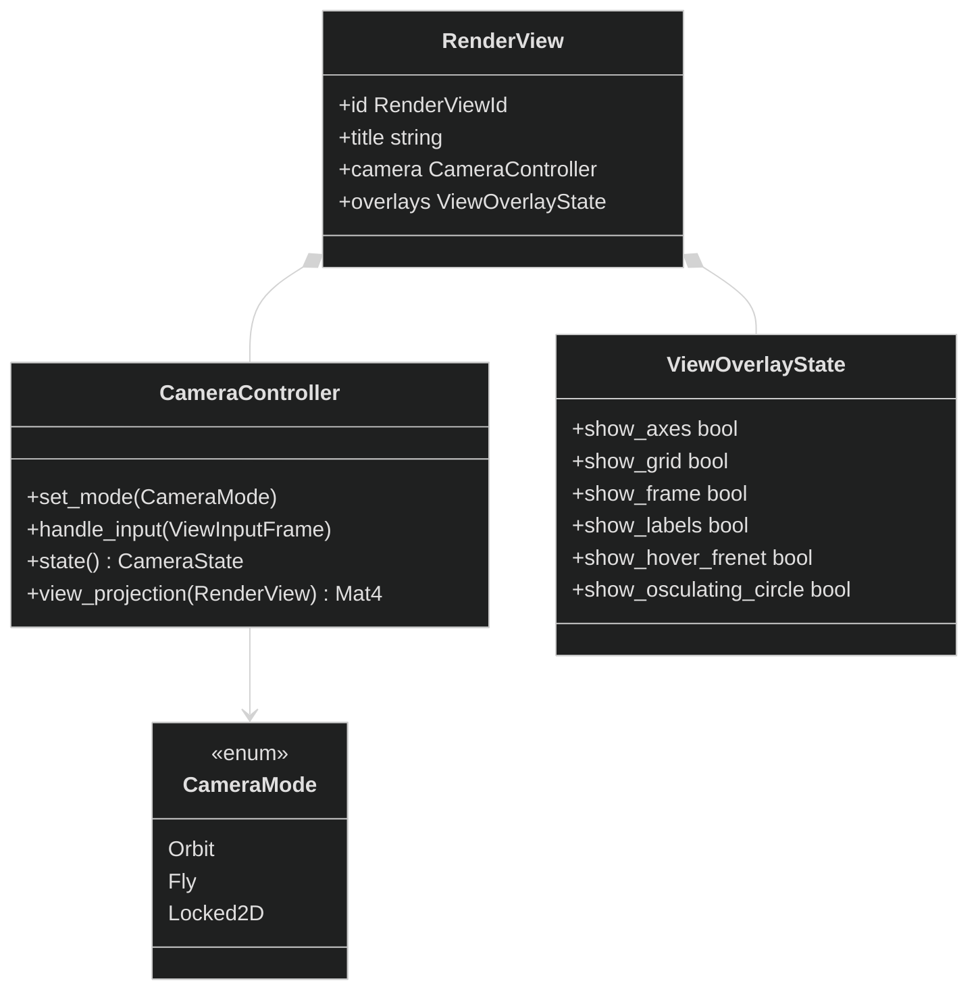

Default camera model:

- Right drag: orbit
- Shift + right drag: pan
- Wheel: zoom
- `F` or `Home`: frame surface/all particles
- Later: double-click sets orbit pivot under cursor
- Optional later mode: fly camera with right mouse look and WASD/QE

Axes/grid/frame overlays should emit render packets just like simulation geometry, so captures and alternate views remain consistent.

## Hover Math Overlays

Hover inspection is a render-view feature backed by simulation math queries. The view determines what is under the cursor; the simulation answers the math question.

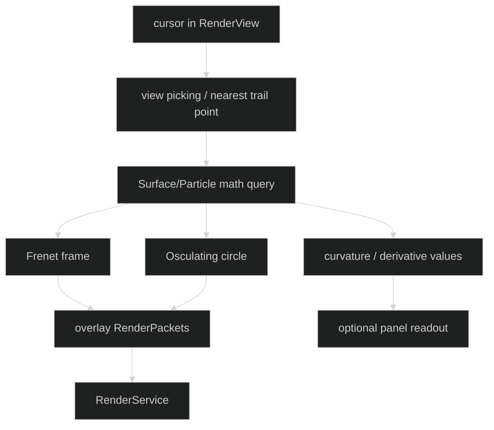

Rules:

- Frenet frame and osculating circle overlays remain first-class features.
- Hover overlays are controlled by `ViewOverlayState`.
- Overlay geometry is renderer-neutral and goes through `RenderService`.
- Picking should use a standard path: screen point -> render view camera -> surface hit or nearest particle/trail point -> simulation math query.
- The simulation provides derivative/frame/curvature data; the renderer only draws the resulting geometry.

## Memory And Allocation Rule

All dynamic allocation goes through a central allocation facility. Stack allocation is allowed.

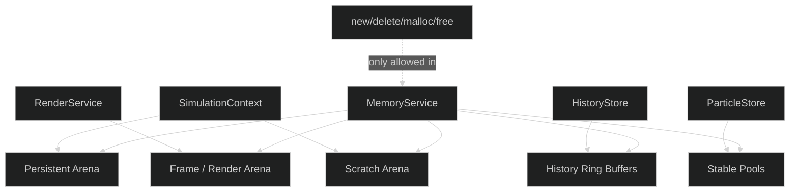

Rules:

- `new`, `delete`, `malloc`, `free`, and raw heap allocation appear only inside allocator/memory facility code.
- Standard containers are allowed only when backed by approved allocators, or in explicitly exempt boundary/setup code.
- Callback storage allocation is owned by services, not scattered through simulation code.
- Start with audit/report mode, then enforce after migration.

## Panel And Hotkey Registration

Panels and hotkeys are registered against services and return handles. Simulations can register callbacks, but the services own callback storage and allocation policy.

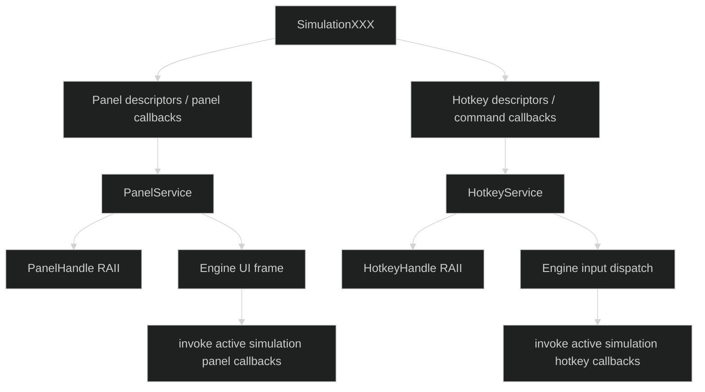

## Proposed Frame Flow

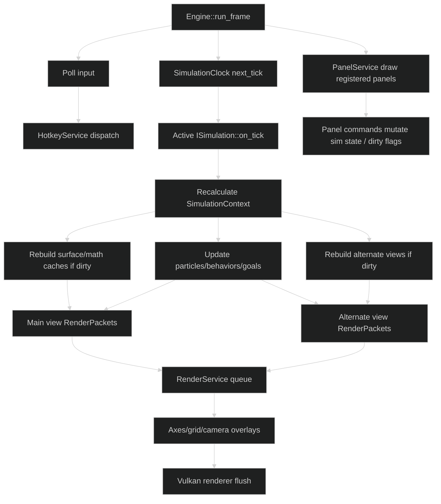

## Current Refactor Scope

In scope for this architecture refactor:

- `ISimulation`
- concrete `SimulationXXX` objects
- engine-owned service access through `SimulationHost`
- `PanelService`
- `HotkeyService`
- `RenderService`
- render views and alternate views
- reusable camera controller and axes/grid overlays
- `SimulationContext` as state container
- central allocation facility policy
- NDDE type/math routing constraints

Out of scope for this pass:

- multithreaded simulation/render separation
- config-authored simulations
- full editor tooling
- scripting/plugin runtime

## Implementation / Audit Item

Add a CI/static audit check for forbidden allocation and type usage patterns, with an allowlist for allocator/memory facility code and temporary explicit exemptions.

Candidate scan patterns:

- `\bnew\b`
- `\bdelete\b`
- `malloc`
- `free`
- unapproved `std::vector`
- unapproved `std::string`
- unapproved `std::make_unique`
- `std::function` outside service/registration code

Start as warning/report-only. Make it enforcing after the allocation migration is complete.
