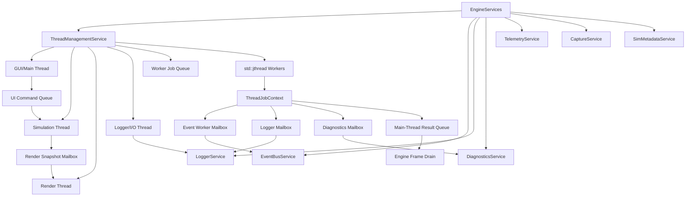

# ThreadManagementService Design

**Status:** implementation in progress; worker-pool foundation implemented  
**Scope:** full application threading, worker lifecycle, render/UI separation, job submission, shutdown, mailboxes, and cross-thread service boundaries  
**Owner:** `EngineServices`  
**Intent:** move the app toward a fully threaded runtime while keeping ownership explicit, cancellable, observable, and unable to corrupt simulation/UI/renderer state

## Purpose

`ThreadManagementService` owns the engine's background execution model.

It answers:

- Which threads exist?
- Which service owns their lifetime?
- Which thread owns UI, simulation, rendering, logging, telemetry, and workers?
- How is work submitted?
- How is work cancelled?
- How do workers report progress, failures, logs, and events?
- Which APIs are main-thread only?
- How does shutdown wait for outstanding work without deadlocks?

The service is not the event bus, logger, diagnostics service, telemetry store,
or renderer. It coordinates background execution and routes cross-thread
communication through bounded service-owned mailboxes.

```text
ThreadManagementService = app thread lifecycle and job execution.
EventBusService         = compact discrete happenings and worker event mailbox.
LoggerService           = human-readable log records and string storage.
DiagnosticsService      = correctness/trust issues and active broken-state records.
TelemetryService        = sampled numeric/state measurements.
Renderer/Platform       = main/render-thread Vulkan, GLFW, and ImGui ownership.
```

The first implemented milestone is not merely "some background workers": it is
the engine-owned execution substrate that future simulation/render/logger
threads will depend on. The current implementation includes:

- `ThreadManagementService` under `src/engine/threading`
- engine ownership through `EngineServices`
- access through `SimulationHost`
- bounded worker queue using `std::jthread`
- cancellable jobs using `std::stop_source` / `std::stop_token`
- job status tracking and completed result drain
- worker-to-owner mailboxes for logs, diagnostics, and compact event records
- logger-thread drain for worker log messages
- logger snapshots for UI reads while the logger thread is active
- main-thread role tracking and deterministic shutdown
- focused unit tests and tidy build coverage

The target is not merely "some background workers." The target is a fully
threaded application:

```text
GUI/Main thread       = GLFW polling, ImGui command construction, UI service drains.
Simulation thread    = simulation tick, scenario state, math state mutation.
Render thread        = Vulkan command recording/submission/presentation.
Logger/I/O thread    = log file sinks, telemetry flush, capture manifests.
Worker pool          = bounded large jobs such as cache builds and validation.
```

This should happen sooner rather than later. The app is still small enough that
thread ownership can be introduced cleanly before accidental shared-state
patterns harden into the architecture.

Examples of work that belongs here:

- offline capture conversion launcher state, if added later
- expensive geometry/cache generation
- scenario validation batches
- metadata indexing
- telemetry flush jobs
- file import/export jobs
- future solver jobs that can run outside the main simulation tick

Examples of work that does not belong here:

- direct ImGui calls
- direct GLFW calls
- direct Vulkan swapchain/presentation calls from non-render threads
- mutating active simulation state from a worker
- publishing typed simulation events directly from arbitrary worker threads

## C++ Engineering Standard

Implementation should follow modern C++ best practices as expressed in the C++
Core Guidelines and related industry guidance. The project targets modern C++
in the C++20/C++23 style: prefer clear ownership, RAII, value semantics where
appropriate, strong project scalar aliases, and narrow dependencies.
Use project standard types such as `byte`, `f32`, `f64`, `i32`, `u32`, and `u64`
where they express project-owned domain data. It is acceptable to use native
boundary types such as `int`, `std::size_t`, `std::thread::id`, or external
enum/integer types where the STL, ImGui, GLFW, Vulkan, filesystem APIs, or
another library API expects them.

Prefer the standard vocabulary types available in modern C++20/C++23 when they
make intent explicit: `std::optional` for meaningful absence, `std::expected`
for recoverable fallible operations, and `std::variant` for closed sets of
known runtime categories. These should be favored over sentinel values, loosely
structured status codes, output-parameter error channels, or `dynamic_cast`
where a type-safe result or sum type expresses the contract clearly.

Use the Rule of Zero for ordinary value/config/model types. Use the Rule of
Three or Rule of Five where a type manages ownership, lifetime, polymorphism, or
non-trivial copy/move behavior. Abstract interfaces should make slicing
impossible while still allowing derived types to use appropriate copy/move
semantics.

After major changes and before check-ins, run the normal build/tests and the
clang-tidy build. The tidy build is the guardrail for guideline issues such as
special member function policy:

```powershell
cmake -S . -B cmake-build-tidy -G Ninja -DCMAKE_BUILD_TYPE=Tidy
cmake --build cmake-build-tidy --target nurbs_dde
```

## Ownership

`ThreadManagementService` is owned by the engine through `EngineServices`.

```cpp
class EngineServices {
public:
    ThreadManagementService& threads() noexcept;
};
```

The engine owns this service because engine shutdown must stop workers before
destroying services, windows, Vulkan objects, simulation state, and memory
arenas that workers might otherwise reference.

When full threading is enabled, `Engine` becomes the orchestrator rather than
the place where every subsystem executes inline. It starts the GUI/main loop,
owns service lifecycle, and coordinates shutdown. The simulation, render,
logger/I/O, and worker executors are owned through `ThreadManagementService`.

Initial code location:

```text
src/engine/threading/
    ThreadManagementService.hpp
    ThreadManagementService.cpp
    ThreadTypes.hpp
```

## Architectural Position



## Non-Goals

`ThreadManagementService` must not:

- own mathematical simulation state
- own renderer/Vulkan resources
- call ImGui, GLFW, or swapchain APIs from workers
- allow multiple threads to mutate one service without an explicit mailbox or
  synchronization contract
- publish typed simulation events directly from workers
- store unbounded strings, paths, image frames, or telemetry rows
- hide failures in worker-local logs
- detach threads that outlive engine shutdown
- make shutdown depend on arbitrary sleeps

## Thread Roles

```cpp
enum class ThreadRole : u8 {
    Main,
    Gui,
    Simulation,
    Renderer,
    Logger,
    Worker,
    Io,
    Telemetry,
    Unknown
};
```

Current runtime is mostly single-threaded:

- GLFW, ImGui, and current Vulkan presentation run on the main thread.
- Simulation ticks run on the main thread.
- Event log drain runs on the main thread.
- Telemetry push paths are designed for one producer and one consumer.
- A compact event worker mailbox exists, but the main runtime loop has not yet
  been split.

Target split:

```text
GUI/Main thread
Simulation thread
Renderer thread
Logger/I/O thread
Worker pool
```

This split is a near-term architectural goal. It should be phased, but the
thread ownership rules should be documented and enforced before large new
systems assume a single-threaded engine.

## Thread Ownership Matrix

| System | Owning Thread | Other Threads May |
|---|---|---|
| GLFW window/events | GUI/Main | enqueue commands only |
| ImGui frame/build | GUI/Main | enqueue UI model updates only |
| Vulkan renderer/swapchain | Render | submit immutable render snapshots only |
| Active simulation state | Simulation | enqueue commands/jobs only |
| `EventBusService` typed channels | owning channel thread | use worker compact mailbox only |
| `LoggerService` string store | Logger/Main during transition | enqueue log records/mailbox messages |
| `DiagnosticsService` active issues | Main/Diagnostics drain | enqueue diagnostic reports |
| `TelemetryService` producer buffer | Simulation producer, Logger/I/O consumer | respect SPSC contracts |
| Worker pool | Worker threads | use constrained `ThreadJobContext` |

No row should silently become "everyone can mutate it." If a second thread needs
access, add an explicit command queue, mailbox, immutable snapshot, or owned
resource transfer.

## Frame Pipeline

The intended steady-state loop is:

```text
GUI/Main:
  poll GLFW
  build ImGui commands and panels from snapshots
  enqueue simulation commands
  drain diagnostics/events/logger snapshots for display

Simulation:
  consume simulation commands
  advance SimulationRuntime tick
  publish compact events/telemetry
  produce immutable SimulationRenderSnapshot

Render:
  consume latest SimulationRenderSnapshot
  build/record Vulkan command buffers
  render scene and UI draw data
  present swapchain image

Logger/I/O:
  drain log mailbox
  flush telemetry/capture/log files
  publish compact completion/failure records

Worker Pool:
  execute bounded jobs
  publish compact worker records
  enqueue typed results/resources for owner-thread adoption
```

The first version can run GUI and render on the same OS thread if GLFW/ImGui
constraints make that simpler, but the service contract should still isolate
"UI command construction" from "render submission" so they can split later.

## Cross-Thread Data Patterns

Use one of these patterns for every cross-thread handoff:

- `CommandQueue<T>`: ordered commands from one owner to another.
- `LatestValueMailbox<T>`: latest snapshot wins; stale render/simulation
  snapshots may be dropped.
- `SpscRing<T>`: one producer, one consumer, fixed-size high-rate stream.
- `MpscMailbox<T>`: many workers report compact results to one owner.
- `ResourceId` transfer: large data stored by a resource owner, passed by ID.
- immutable `shared_ptr<const T>` snapshot: acceptable for coarse immutable
  state while migrating, but do not mutate through shared ownership.

Avoid:

- arbitrary `std::shared_ptr<T>` to mutable state across threads
- global locks around broad engine services
- detached threads
- workers calling back into UI/render/simulation services directly

## Job Model

Jobs are explicit units of background work. They should be cancellable,
observable, and bounded in their service interactions.

```cpp
struct ThreadJobId {
    u64 value = u64(0);

    friend constexpr bool operator==(ThreadJobId, ThreadJobId) noexcept = default;
};

enum class ThreadJobPriority : u8 {
    Low,
    Normal,
    High
};

enum class ThreadJobState : u8 {
    Queued,
    Running,
    Completed,
    CancelRequested,
    Cancelled,
    Failed
};

struct ThreadJobDescriptor {
    ThreadJobId id = {};
    ComponentId owner = ids::unknown_component;
    RuntimeNodeId node = {};
    ThreadJobPriority priority = ThreadJobPriority::Normal;
    bool cancellable = true;
};
```

The worker callback receives a constrained context:

```cpp
class ThreadJobContext {
public:
    [[nodiscard]] ThreadJobId job_id() const noexcept;
    [[nodiscard]] std::stop_token stop_token() const noexcept;

    void publish_worker_record(events::EventRecord record);
    void report_diagnostic(DiagnosticReport report);
    void log(LogSeverity severity, LogCategory category, std::string_view message);

    template <class Result>
    void complete(Result result);
};
```

The context should expose only thread-safe cross-thread channels. It should not
expose mutable engine services wholesale.

## Public API

```cpp
using ThreadJobFn = std::function<void(ThreadJobContext&)>;

struct ThreadPoolConfig {
    u32 worker_count = u32(0);       // 0 means choose a conservative default.
    u64 max_queued_jobs = u64(256);
    u64 max_completed_results = u64(256);
    bool enable_simulation_thread = true;
    bool enable_render_thread = true;
    bool enable_logger_thread = true;
    bool enable_background_workers = true;
};

class ThreadManagementService {
public:
    ThreadManagementService() = default;
    ~ThreadManagementService();

    ThreadManagementService(const ThreadManagementService&) = delete;
    ThreadManagementService& operator=(const ThreadManagementService&) = delete;
    ThreadManagementService(ThreadManagementService&&) = delete;
    ThreadManagementService& operator=(ThreadManagementService&&) = delete;

    void init(ThreadPoolConfig config, ThreadServiceBindings bindings);
    void shutdown() noexcept;

    [[nodiscard]] ThreadJobId submit(ThreadJobDescriptor descriptor,
                                     ThreadJobFn job);

    void request_cancel(ThreadJobId id) noexcept;
    void request_cancel_all() noexcept;

    void drain_service_mailboxes();

    [[nodiscard]] std::span<const ThreadJobStatus> jobs() const noexcept;
    [[nodiscard]] std::optional<ThreadJobStatus> status(ThreadJobId id) const;
    [[nodiscard]] std::vector<ThreadJobResult> consume_completed_results();
    [[nodiscard]] bool is_main_thread() const noexcept;
};
```

The first implementation omits a full priority scheduler but does prefer higher
priority queued jobs when a worker picks the next item. It keeps priority in
descriptors so the public contract remains stable when a more sophisticated
scheduler is added.

Runtime threads should be independently toggleable during migration. That lets
us split logger/I/O first, then simulation, then rendering, without landing one
giant risky rewrite.

## Communication Boundaries

Worker threads must not call arbitrary service APIs. They communicate through
explicit channels.

### EventBusService

Workers may publish compact records only:

```text
worker -> EventBusService::enqueue_worker_record(EventRecord)
main   -> EventBusService::drain_worker_mailbox()
main   -> EventLog::drain()
```

Typed event dispatch remains main/simulation-thread only unless a specific
channel is made MPSC-safe.

### LoggerService

Workers and simulation/render threads should not mutate logger string storage
directly in the final design. They should write to a `LoggerMailbox` or submit
a result that the logger thread formats and stores. The current logger design
reserves this as future work.

### DiagnosticsService

Workers report diagnostics through a diagnostics mailbox. The main thread
ingests them into `DiagnosticsService` so the "Stuff Is Broken" panel reads one
consistent source of truth.

### TelemetryService

Telemetry already has SPSC-oriented buffer contracts. Thread management should
not turn telemetry into a general job queue. If a telemetry flush worker is
added, it owns file flushing only and must respect the existing producer/consumer
boundaries.

### Renderer And Platform

Workers do not call:

- GLFW
- ImGui
- Vulkan swapchain acquire/present
- renderer submission APIs that mutate frame state

Workers may prepare CPU-side data that the main/render thread later consumes
through an explicit result queue.

The render thread owns Vulkan command recording/submission and swapchain
presentation once the split is enabled. GUI/Main owns GLFW polling and ImGui
frame construction. The handoff between GUI and render should be explicit:
either render consumes immutable ImGui draw data produced by GUI, or GUI/render
remain the same thread until this boundary is safe.

## Result Model

Worker results should be typed and bounded. Avoid returning strings and paths
through the worker result payload when an ID can be used.

```cpp
struct GeometryBuildResult {
    ThreadJobId job = {};
    ResourceId resource = {};
    u64 vertex_count = u64(0);
    u64 index_count = u64(0);
};

struct ValidationJobResult {
    ThreadJobId job = {};
    RuntimeNodeId scenario = {};
    u64 warning_count = u64(0);
    u64 error_count = u64(0);
};

using ThreadJobResult = std::variant<
    GeometryBuildResult,
    ValidationJobResult,
    DiagnosticId,
    ResourceId
>;
```

Large buffers should continue to use the project's existing `MemoryService`
scopes, PMR arenas, `BufferManager`, renderer ownership, or capture/file owners
for storage. When data must cross thread, frame, or service ownership
boundaries, register it with `ResourceManagerService` and pass `ResourceId`
rather than raw pointers or large payloads.

## Shutdown Contract

Shutdown must be boring and deterministic:

1. Stop accepting new jobs.
2. Request stop on worker pool jobs.
3. Request stop on logger/I/O thread after producers are quiet.
4. Request stop on simulation thread after UI command input is closed.
5. Request stop on render thread after simulation snapshots are closed.
6. Allow running threads to observe `std::stop_token`.
7. Join all `std::jthread` executors through destruction or explicit reset.
8. Drain diagnostics, logs, events, and results on the main thread.
9. Destroy services and Vulkan/platform resources only after runtime threads
   are idle.

Workers must not capture raw pointers to engine-owned resources unless the job
lifetime is strictly bounded and the owner waits for completion before teardown.

## Diagnostics

Thread failures are diagnostics, not just logs.

Examples:

- worker callback threw an exception
- job exceeded a deadline
- job ignored cancellation
- queue overflow
- result mailbox overflow
- worker tried to use a main-thread-only API

`ThreadManagementService` should report these through `DiagnosticsService`
using `DiagnosticSubsystem::Threading` and `ErrorCode::ThreadFault` or a more
specific future code.

## Events

The service should publish compact event records for:

- job queued
- job started
- job completed
- job cancelled
- job failed
- worker mailbox overflow

Typed event descriptors for these should be registered with
`SimMetadataService` or a future app metadata registry. Event payloads should
carry `ThreadJobId`, `RuntimeNodeId`, `DiagnosticId`, and scalar counters, not
thread names or formatted messages.

## Logging

Logger output is narrative and optional:

- `Worker job 14 completed`
- `Geometry cache job 21 produced resource 902`
- `Worker mailbox dropped 3 records`

The logger should format these from IDs and service lookups. It should not be
the source of truth for job state.

## UI

Future UI panels:

- Worker/Jobs panel: queued/running/completed/failed job table
- Thread health panel: worker count, queue depth, drops, last fault
- Diagnostics "Stuff Is Broken" panel: active thread failures

The UI reads service state on the main thread. It does not inspect worker
internals or block waiting for jobs.

## Migration Plan

1. Add `ThreadManagementService` under `src/engine/threading`. **Done.**
2. Add `threads()` to `EngineServices` and `SimulationHost`. **Done.**
3. Add bounded worker job queue and `std::jthread` worker pool. **Done.**
4. Route compact worker records through `EventBusService`. **Done.**
5. Add diagnostics/log mailboxes and main-thread ingestion. **Done.**
6. Add thread-role assertions for main/GUI/render/simulation-only APIs.
7. Add logger mailbox and logger/I/O thread first; it has the least coupling. **Logger-thread in-memory drain done.**
8. Move telemetry/log/capture manifest flushing to logger/I/O.
9. Add immutable render snapshot type and simulation-to-render mailbox.
10. Split simulation tick into a simulation thread.
11. Split render submission/presentation into a render thread, or explicitly
    keep GUI/render co-owned until GLFW/ImGui/Vulkan boundaries are safe.
12. Move expensive geometry/cache generation onto worker jobs.
13. Add worker/jobs/thread-health UI panel.

## Unit Test Targets

- service follows Rule of Five policy
- init/shutdown with zero workers is safe **Covered.**
- submitted job reaches completed state **Covered.**
- cancellation request is observable through `std::stop_token` **Covered.**
- queued job overflow is reported **Covered.**
- worker exception becomes a diagnostic **Covered.**
- compact worker event records drain through `EventBusService` **Covered.**
- results are delivered only through owner-thread drains **Covered.**
- shutdown joins workers and rejects new jobs **Partially covered.**
- jobs do not run after `shutdown()` **Partially covered.**
- GUI-only APIs assert/reject when called off GUI thread
- render-only APIs assert/reject when called off render thread
- simulation-only APIs assert/reject when called off simulation thread
- logger thread drains mailbox without mutating event/diagnostic sources **Covered for worker log mailbox.**
- latest render snapshot mailbox drops stale snapshots safely

## Open Decisions

- Should the first pool be fixed-size or dynamically sized?
- Should job priorities affect scheduling immediately or remain metadata for
  the first version?
- Should worker results use one shared variant or per-subsystem result queues?
- Should long-running solver jobs be supported before or after the simulation
  thread is split from the main thread?
- Should logger/diagnostics mailboxes be separate services or owned adapters
  inside `ThreadManagementService`?
- Should GUI and render be split immediately, or should the first milestone keep
  them co-threaded while separating simulation and logger/I/O?
- Which Vulkan objects are allowed to cross the GUI/render boundary, if any?
